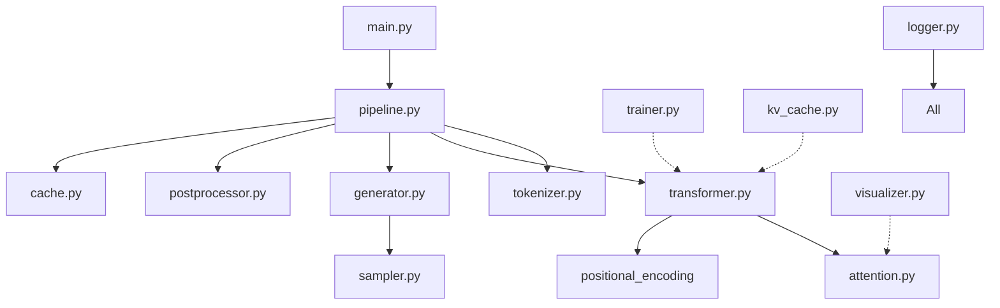

# 项目架构优化方案

## 📊 当前架构评估

### 项目特点
- **代码规模**: ~4,500 行 Python 代码
- **模块数量**: 11 个核心模块
- **项目性质**: 教育演示项目（非生产环境）
- **测试状态**: ✅ 7/7 全部通过

### 现有结构
```
scripts/
├── __init__.py          # 空文件
├── main.py              # 入口脚本
├── pipeline.py          # 管道整合
├── tokenizer.py         # Tokenizer (21KB)
├── attention.py         # Attention (11KB)
├── transformer.py       # Transformer (44KB) ⚠️ 最大
├── generator.py         # Generator (13KB)
├── postprocessor.py     # PostProcessor (14KB)
├── cache.py             # Cache (10KB)
├── kv_cache.py          # KV Cache (14KB)
├── trainer.py           # Trainer (24KB)
├── visualizer.py        # Visualizer (14KB)
├── logger.py            # Logger (8KB)
└── tests/               # 测试目录
    ├── test_all.py
    └── verify_math.py
```

---

## 🎯 架构优化建议

### 方案对比

| 方案 | 复杂度 | 收益 | 风险 | 推荐度 |
|------|--------|------|------|--------|
| **A. 保持现状 + 文档优化** | ⭐ | ⭐⭐⭐ | 无 | ⭐⭐⭐⭐⭐ |
| B. 轻量级分组（注释） | ⭐⭐ | ⭐⭐⭐⭐ | 低 | ⭐⭐⭐⭐ |
| C. 物理分目录（之前尝试） | ⭐⭐⭐⭐⭐ | ⭐⭐ | 高 | ⭐⭐ |

---

## ✅ 推荐方案：保持现状 + 增强组织性

### 理由
1. **项目规模适中** - 11个文件完全可以平铺管理
2. **教育目的优先** - 简单结构更易于学习
3. **避免过度工程** - 不需要工业级的复杂架构
4. **维护成本低** - 无需处理复杂的导入问题

### 具体优化措施

#### 1. 文件头添加模块分类注释

在每个文件顶部添加清晰的分类标识：

```python
"""
[Core] Tokenizer Module - 文本分词器
=====================================
功能：将源代码文本转换为token序列
依赖：logger
被依赖：transformer, generator, pipeline
"""
```

分类标签：
- `[Core]` - 核心模型组件（tokenizer, attention, transformer）
- `[Generation]` - 代码生成（generator, postprocessor）
- `[Optimization]` - 性能优化（cache, kv_cache）
- `[Training]` - 训练系统（trainer）
- `[Utils]` - 工具模块（logger, visualizer）
- `[Integration]` - 整合层（pipeline, main）

#### 2. 创建 ARCHITECTURE.md 文档

在项目根目录创建架构说明文档，包含：
- 模块依赖关系图
- 数据流说明
- 设计原则
- 扩展指南

#### 3. 优化 `__init__.py` 提供统一导入

```python
"""
LLM Code Generation Demo
统一导入接口
"""

# Core Modules
from .tokenizer import SimpleTokenizer
from .attention import MultiHeadAttention
from .transformer import TransformerModel

# Generation
from .generator import CodeGenerator
from .postprocessor import CodePostProcessor

# Optimization
from .cache import ResultCache
from .kv_cache import KVCa

# Training
from .trainer import Trainer

# Utils
from .logger import logging_context
from .visualizer import AttentionVisualizer

# Pipeline
from .pipeline import CodeGenerationPipeline

__version__ = '1.3.0'
__all__ = [
    'SimpleTokenizer',
    'MultiHeadAttention',
    'TransformerModel',
    'CodeGenerator',
    'PostProcessor',
    'KVCa
    'ResultCache',
    'Trainer',
    'logging_context',
    'AttentionVisualizer',
    'CodeGenerationPipeline'
]
```

#### 4. 大文件拆分建议（可选，P2优先级）

**transformer.py (44KB)** 可以考虑拆分为：
```
transformer/
├── __init__.py
├── model.py          # TransformerModel 主类
├── encoder.py        # Encoder 相关
├── decoder.py        # Decoder 相关
└── positional_encoding.py  # 位置编码
```

**但注意**：对于教育项目，保持单文件可能更易于理解！

#### 5. 改进 README 中的架构图

在 README 中添加清晰的模块关系图：



---

## 📋 实施清单

### P0 - 立即执行（1小时内）
- [ ] 清理临时文件（update_imports.py等）
- [ ] 完善 `scripts/__init__.py` 导出接口
- [ ] 在每个文件头部添加分类注释
- [ ] 更新 README 添加模块关系图

### P1 - 近期完成（1天内）
- [ ] 创建 ARCHITECTURE.md 文档
- [ ] 整理模块依赖关系
- [ ] 添加使用示例到各模块docstring
- [ ] 优化 IDE 配置（标记 sources root）

### P2 - 长期规划（按需）
- [ ] 考虑拆分 transformer.py（如果超过60KB）
- [ ] 添加类型提示（Type Hints）
- [ ] 增加单元测试覆盖率
- [ ] 添加性能基准测试

---

## 🚫 不建议的做法

### ❌ 深度目录分割
**原因**：
- 增加导入复杂度
- 降低代码可读性
- 对教育项目不必要
- 维护成本高

### ❌ 引入构建工具（setup.py/pyproject.toml）
**原因**：
- 项目不需要打包发布
- 增加学习门槛
- 当前运行方式已足够简单

### ❌ 过度抽象和接口层
**原因**：
- 教育项目需要直观
- 直接实现比抽象更重要
- 保持代码透明性

---

## 💡 架构原则总结

对于这个教育性质的 LLM 演示项目：

1. **清晰 > 复杂** - 让学生容易理解
2. **实用 > 完美** - 能工作就好，不必追求最佳实践
3. **透明 > 抽象** - 展示内部实现而非隐藏
4. **渐进 > 激进** - 逐步优化而非大规模重构
5. **文档 > 代码** - 好的注释和文档比优雅的架构更重要

---

## 📈 何时需要考虑重构？

当出现以下信号时，再考虑更深层次的架构调整：

- [ ] 代码量超过 10,000 行
- [ ] 单个文件超过 100KB
- [ ] 模块数量超过 20 个
- [ ] 需要支持多种后端/插件
- [ ] 团队协作人数超过 5 人
- [ ] 需要发布为独立包

**当前状态**：远未达到这些阈值，保持简单即可！

---

*最后更新: 2026-05-19*
*版本: v1.3*
