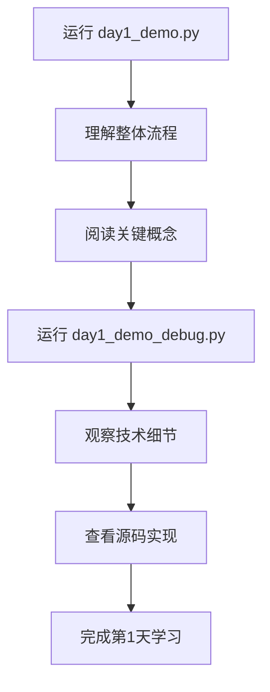

# Day1 演示脚本使用说明

## 📋 脚本概览

项目提供了两个第1天的演示脚本，针对不同的学习目标和使用场景：

| 脚本 | 大小 | 用途 | 适用人群 |
|------|------|------|----------|
| **day1_demo.py** | 15KB | 教学版 - 系统学习 | 初学者、想理解原理的学习者 |
| **day1_demo_debug.py** | 1.7KB | Debug版 - 技术细节 | 进阶用户、调试开发者 |

---

## 🎓 day1_demo.py（教学版）

### 特点
- ✅ 结构化的章节设计（7个步骤）
- ✅ ASCII流程图直观展示整体架构
- ✅ 对比实验表格（vocab_size、temperature）
- ✅ 源码链接提示（7处）
- ✅ 学习要点、核心概念、思考题、实践建议
- ❌ 关闭 debug_mode，不显示底层技术细节

### 输出示例
```
================================================================================
  第1天学习：LLM代码生成完整流程
================================================================================

    ┌─────────────────────────────────────────────────────────────────┐
    │                    LLM代码生成完整流程                            │
    └─────────────────────────────────────────────────────────────────┘
    
    输入文本 → Token化 → Transformer推理 → 采样 → 后处理 → 输出代码
       │          │           │              │         │
       ...

--------------------------------------------------------------------------------
  Step 1: 初始化模型管道
--------------------------------------------------------------------------------

  💡 学习要点: 模块化设计
     整个系统由多个独立模块组成：Tokenizer、Transformer、Generator等
     📖 查看源码: scripts/tokenizer.py (第1-50行)
        SimpleTokenizer类定义
```

### 适用场景
- 🎯 第一次学习LLM工作原理
- 🎯 想理解每个模块的作用和关系
- 🎯 需要系统的学习路径和指导
- 🎯 想要知道下一步该学什么

### 运行方式
```bash
python day1_demo.py
```

### 日志文件
```
logs/day1_demo_YYYYMMDD.log
```

---

## 🔧 day1_demo_debug.py（Debug版）

### 特点
- ✅ 简洁直接，没有额外的教学说明
- ✅ 启用 debug_mode=True，输出完整的计算过程
- ✅ 启用 verbose=True，显示每一步的详细日志
- ✅ 可以看到Attention权重、Tensor形状等底层信息
- ❌ 没有结构化讲解和学习指导

### 输出示例
```
================================================================================
第1天学习：基本代码生成流程
================================================================================

[输入] Prompt: 'public class UserService'

================================================================================
开始生成代码...
================================================================================

============================================================
[Pipeline] 初始化代码生成管道 (debug_mode=True)
============================================================

[Step 1] 创建Tokenizer...

[Step 2] 创建Transformer模型...

============================================================
[TransformerModel] 初始化完整模型 (debug_mode=True)
============================================================
  - 词汇表大小: 1000
  - 模型维度: 128
  - 注意力头数: 8
  ...

[Transformer] 开始Decoder过程
  - Target shape: torch.Size([1, 1])
  - Memory shape: torch.Size([1, 32, 128])
  
  --- Decoder Layer 1 ---
  
[DecoderLayer] 前向传播
  - Target shape: torch.Size([1, 1, 128])
  - Memory shape: torch.Size([1, 32, 128])
  - Output shape: torch.Size([1, 1, 128])
  
  Step 0: Generated '<UNK>' (ID: 455)
    Top-5 predictions:
      - '<UNK>' (prob: 0.0043)
      ...
```

### 适用场景
- 🔧 调试代码时查看底层实现
- 🔧 深入理解Attention机制的计算过程
- 🔧 观察Token化的详细步骤
- 🔧 分析模型的前向传播
- 🔧 检查Tensor的形状和数据流

### 运行方式
```bash
python day1_demo_debug.py
```

### 日志文件
```
logs/day1_demo_debug_YYYYMMDD.log
```

---

## 📊 对比总结

### 选择建议

**如果你是初学者**：
```
✅ 使用 day1_demo.py
   - 有清晰的学习路径
   - 有关键概念解释
   - 有实践指导建议
```

**如果你在调试或研究底层实现**：
```
✅ 使用 day1_demo_debug.py
   - 看到完整的技术细节
   - 观察中间计算过程
   - 分析数据流动
```

**如果你想全面学习**：
```
1️⃣ 先运行 day1_demo.py 建立整体认知
2️⃣ 再运行 day1_demo_debug.py 深入理解细节
3️⃣ 最后阅读相关源码加深理解
```

---

## 🔄 工作流程建议

### 推荐的学习顺序



### 具体步骤

1. **第一步**: 运行教学版建立认知
   ```bash
   python day1_demo.py
   ```
   - 观看完整流程
   - 理解每个步骤的作用
   - 记录疑问点

2. **第二步**: 运行Debug版深入细节
   ```bash
   python day1_demo_debug.py
   ```
   - 观察Attention计算
   - 查看Tensor形状变化
   - 理解数据流动

3. **第三步**: 阅读相关源码
   - `scripts/tokenizer.py` - Token化实现
   - `scripts/attention.py` - 注意力机制
   - `scripts/transformer.py` - Transformer架构

4. **第四步**: 完成思考题和实践建议
   - 回答脚本中的思考题
   - 尝试建议的实验
   - 准备第2天的学习

---

## 💡 常见问题

### Q1: 我应该用哪个脚本？
**A**: 
- 初学者 → `day1_demo.py`
- 调试/研究 → `day1_demo_debug.py`
- 全面学习 → 两个都用

### Q2: 两个脚本的输出会冲突吗？
**A**: 不会。它们生成不同的日志文件：
- `day1_demo_YYYYMMDD.log`
- `day1_demo_debug_YYYYMMDD.log`

### Q3: 可以合并成一个脚本吗？
**A**: 不建议。原因：
- 文件大小差异大（1.7KB vs 15KB）
- 目标用户不同
- 合并后会变得臃肿复杂

### Q4: Debug版输出太多怎么办？
**A**: 
- 重定向到文件：`python day1_demo_debug.py > output.txt`
- 或者使用教学版：`python day1_demo.py`

### Q5: 如何查看历史日志？
**A**: 
```bash
# 查看今天的日志
cat logs/day1_demo_$(date +%Y%m%d).log

# 查看指定日期的日志
cat logs/day1_demo_20260510.log

# 查看所有日志文件
ls -lh logs/day1_demo*.log
```

---

## 📝 总结

| 维度 | day1_demo.py | day1_demo_debug.py |
|------|--------------|-------------------|
| **文件大小** | 15KB | 1.7KB |
| **代码行数** | 389行 | 63行 |
| **debug_mode** | False | True |
| **verbose** | False | True |
| **教学内容** | ✅ 丰富 | ❌ 无 |
| **技术细节** | ❌ 简化 | ✅ 完整 |
| **适合人群** | 初学者 | 进阶用户 |
| **学习路径** | ✅ 清晰 | ❌ 需自行探索 |

**核心理念**: 
- **day1_demo.py** = 教科书（系统、完整、易懂）
- **day1_demo_debug.py** = 实验室（真实、详细、深入）

两者互补，共同构成完整的学习体验！🎓

---

**最后更新**: 2026-05-10  
**版本**: v1.0
